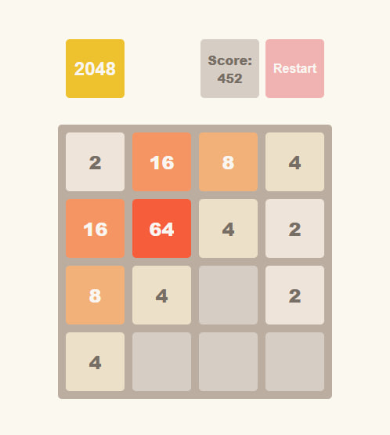

# 🎮 2048 — Classic Puzzle Game in Vanilla JavaScript

A browser-based version of the iconic 2048 puzzle. Slide tiles, combine them, and try to hit the legendary 2048 score! Fully built with native JavaScript — no libraries, just logic and fun.

## 🌐 Live Version

🔗 [Live Demo](https://lolekmakso.github.io/2048/)

## 🧠 How It Works

- 🔢 **4×4 Board** — merge identical tiles to build bigger numbers
- 🎯 **Live Scoring** — your score updates with every successful merge
- 🔄 **Restart Anytime** — hit the reset button to play again
- 🧩 **All in JS** — built from scratch with pure JavaScript

## 🖼️ Screenshot



## 🛠️ Stack & Tools

- **HTML5** — structure of the page
- **CSS3** — grid layout, transitions, and styling
- **JavaScript (ES6)** — game mechanics, state tracking
- **BEM CSS Naming** — modular and clear class structure
- **Keyboard Events** — for controlling the game via arrow keys
- **OOP Approach** — encapsulated logic via a `Game` class

## ✨ Game Features

- ⬅️➡️⬆️⬇️ **Keyboard Controls** — intuitive movement using arrow keys
- 🔄 **Randomized Tile Spawns** — appears with value 2 or 4
- 🔗 **Valid Merge Rules** — one merge per tile per turn
- 🏆 **Win Check** — victory alert once 2048 is reached
- ❌ **Game Over Detection** — prompts when no moves left
- 🕹️ **Dynamic UI** — visual updates after each action
- 📊 **Smart Scoring** — points added from merged tiles

## 🚀 Local Setup

To run the project locally:

1. **Clone the repository**

   ```bash
   git clone https://github.com/lolekmakso/2048.git
   cd 2048
   ```

2. **Open the game in your browser**

   You can simply open the `index.html` file:

   ```bash
   open src/index.html
   # or manually open with your preferred browser
   ```

## 📁 Project Structure

- `/src/modules/Game.class.js` — main class containing game logic:
  - `moveLeft()`, `moveRight()`, `moveUp()`, `moveDown()`
  - `getState()`, `getScore()`, `getStatus()`
  - `start()` and `restart()` methods for full control
- `/src/scripts/main.js` — handles UI rendering and DOM interactions
- `/src/index.html` — game UI with predefined CSS classes
- Supports CSS class conventions like `field-cell--%value%` for tiles
- `keydown` event listener used for capturing player moves

## 🤝 Contributing

Feel free to open issues or submit pull requests if you'd like to enhance the logic, animations, or UI!

## 📫 Reach Out

- 💬 Telegram: [@lolekmakso](https://t.me/lolekmakso)
- 📧 Email: [makstarasovv1@gmail.com](mailto:makstarasovv1@gmail.com)
